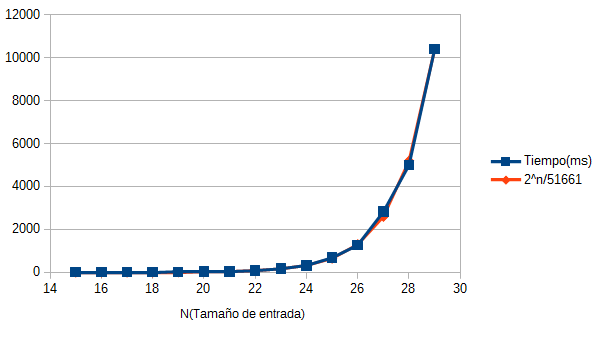

<center><h1>Informe de Práctica 2 de Diseño y Análisis de Algoritmos.</h1></center>

<center><h1>Divide y vencerás: Torres de Hanoi</h1></center>

<center><h3>Pablo Pastor Martín</h3></center>

***

### Introducción


Las Torres de Hanoi es un rompecabezas inventado por Édouard Lucas. El juego consiste en un grupo de discos con radio creciente que se apilan insertándose en una de las tres varillas de las que consta el tablero. El objetivo del rompezabezas es, mediante una serie de movimientos siguiendo las reglas que a continuación veremos, obtener la misma pila de discos original, pero en otra varilla.

Las reglas que se han de seguir son las siguientes:
* Sólo se puede mover un disco a la vez
* Un disco de un radio mayor no puede situarse por encima de uno con radio menor.
* Sólo se puede desplazar el disco que se encuentra en la cima de cada varilla.

Este problema es conocido por ser uno de los mejores ejemplos para explicar el uso de la recursividad. El algoritmo usado para resolver el problema de esta manera lo veremos más adelante. Digno de mención es también que el juego, en su versión tradicional, se ha conseguido resolver de forma iterativa.

Cabe mencionar también, que existen variantes del rompecabezas con más varillas. Destacando de entre estas versiones, aquella que usa 4 de las mismas, para la cual recientemente (en 2014) se ha demostrado que la solución de Frame-Stewart es óptima. En caso de más de 4 varillas, la solución óptima es aún un problema abierto.
Otra de las variantes al problema original la encontramos en su versión cíclica, propuesta por M.D. Atkinson en 1981, variante la cual no es tan fácil de resolver con un algoritmo iterativo.

### Pseudocódigo para la resolución del problema recursivamente

**Problema tradicional:**
```
funcion hanoi(tamaño, var_origen, var_destino, var_auxiliar):
  si tamaño > 0:
    hanoi(tamaño - 1, origen, auxiliar, destino)
    mover_disco_restante(origen, destino)
    hanoi(tamaño - 1, auxiliar, origen, destino)
```

**Variante cíclica:** Se basa en funciones mutuamente recursivas:
```
funcion hanoiHorario(tamaño, var_origen, var_destino, var_auxiliar):
  si tamaño > 0:
    hanoiAntiHorario(tamaño -1, origen, auxiliar, destino)
    mover_disco_restante(origen, destino)
    hanoiAntiHorario(tamaño -1, auxiliar, destino, origen)

funcion hanoiAntiHorario(tamaño, var_origen, var_destino, var_auxiliar):
  si tamaño > 0:
    hanoiAntiHorario(tamaño -1, origen, destino, auxiliar)
    mover_disco_restante(origen, auxiliar)
    hanoiHorario(tamaño -1, destino, origen, auxiliar)
    mover_disco_restante(auxiliar, destino)
    honoiAntiHorario(tamaño - 1, origen, destino, auxiliar)
```

### Análisis de la complejidad del algoritmo implementado:

La complejidad de la variante tradicional es comunmente conocida, tratándose de T(n) = 2<sup>n</sup>-1.

**Árbol de recursión:**


Como se puede ver en el ábol, tenemos:

* `n-1` Niveles
* 2<sup> j</sup> niveles en cada nivel `j`

Por tanto, para cada nivel `j` el trabajo será **2<sup> j</sup>**. Ya que en cada llamada recursiva sólo se realiza un movimiento, que son nuestra unidad de trabajo básica.

A través de ello podemos deducir que el trabajo realizado por el algoritmo desde el primer nivel es:


Cabe destacar que en este algoritmo no hay ni peor caso, por lo que podremos afirmar que lo anteriormente obtenido es a su vez una cuota inferior y superior del algoritmo.

### Comprobación de la complejidad:

Para comprobar que la complejidad que hemos calculado se acuerda a lo observado en el tiempo de ejecución del algoritmo hemos registrado el tiempo que tarda el algoritmo en realizar el trabajo (en milisegundos) para diferentes tamaños de entrada, y hemos comparado la gráfica obtenida con la de la función 2<sup> n</sup>-1. Los datos usados y la gráfica obtenida se muestran a continuación:


| Tamaño de entrada | Tiempo de ejecución(ms)|
| --- | --- |
|15|3|
|16|2|
|17|6|
|18|6|
|19|12|
|20|25|
|21|41|
|22|78|
|23|167|
|24|320|
|25|678|
|26|1267|
|27|2822|
|28|5002|
|29|10392|



*Nota: La constante que multiplica a 2<sup>n</sup> se ha obtenido dividiendo el valor de 2<sup>n</sup> cuando n = 29 entre el valor del tiempo obtenido para ese mismo n.*

*Nota 2: Se ha despreciado el 1 que resta a 2<sup>n</sup>*

Observamos que las gráficas que obtenemos son practicamente idénticas, por lo que podemos afirmar que
se comprueba que la complejidad es la obtenida.

### Conclusiones

Como conclusión podremos nombrar que este algoritmo demuestra cómo la recursividad y el paradigma de "divide y vencerás" resulta tremendamente útil en ciertas problemas, convirtiéndose en la mejor alternativa en estos casos, entre los que figura el problema de las torres de Hanoi.

Adicionalmente podemos destacar el importante papel que tiene la complejidad de los algoritmos en las aplicaciones prácticas, puesto que, como hemos visto en el análisis anteriormente detallado, el tiempo empleado en resolver el problema de las Torres de Hanoi crece de forma exponencial en función del tamaño de entrada del problema. Haciendo que con un número de discos no tan grande, como puede ser 50, se tardasen, a un ritmo de un movimiento por segundo, unos 35 millonesde años.

### Referencias bibliográficas

* Wikipedia, torres de Hanoi: [Wikipedia](https://es.wikipedia.org/wiki/Torres_de_Han%C3%B3i)
* The Cyclic Towers of Hanoi, M.D. ATKINSON [Versión cíclica](https://www.researchgate.net/publication/220112243_The_Cyclic_Towers_of_Hanoi)
